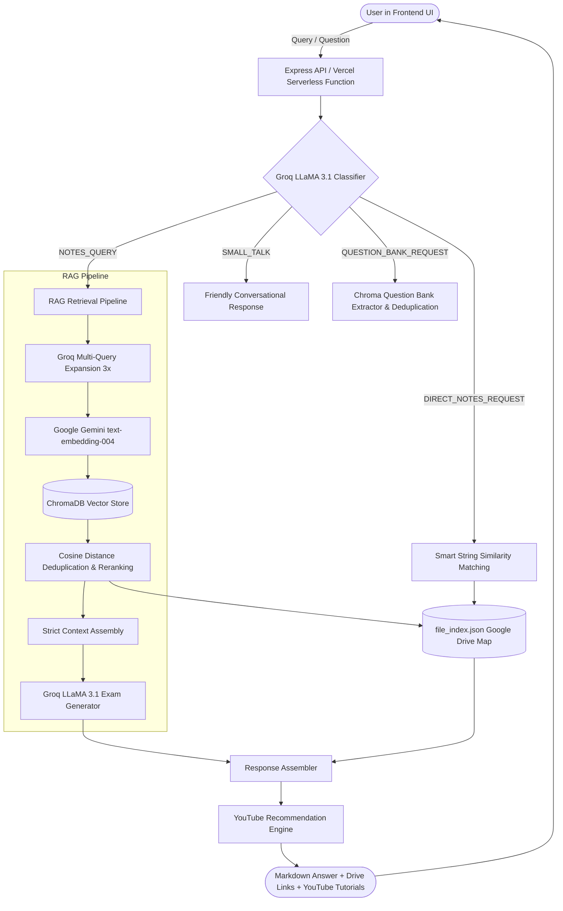

# 🎓 Yoru Chatbot — BMSIT RAG Learning Assistant

[](https://nodejs.org/)
[](https://expressjs.com/)
[](https://trychroma.com/)
[](https://groq.com/)
[](https://ai.google.dev/)
[](https://vercel.com/)
[](https://www.docker.com/)

> An AI-powered Retrieval-Augmented Generation (RAG) educational chatbot specifically engineered for BMSIT engineering students. Combines semantic vector search, exam-focused syllabus grounding, real Google Drive course notes linking, intelligent question bank extraction, and curated YouTube video recommendations.

---

## 📌 Table of Contents
- [Architecture & Workflow](#-architecture--workflow)
- [Key Features](#-key-features)
- [Repository Structure](#-repository-structure)
- [Prerequisites](#-prerequisites)
- [Local Development Setup](#-local-development-setup)
- [Running ChromaDB with Docker](#-running-chromadb-with-docker)
- [Vercel Deployment Guide](#-vercel-deployment-guide)
- [Environment Variables](#-environment-variables)
- [API Endpoints](#-api-endpoints)
- [License](#-license)

---

## 🏗️ Architecture & Workflow



### Retrieval & Generation Highlights:
1. **Intent Classification**: Evaluates each input via Groq (`llama-3.1-8b-instant`) to determine if it is conversational small talk, a direct syllabus document request, a question bank request, or a technical concept query.
2. **Multi-Query Expansion**: Re-phrases technical questions into alternative formulations to combat vocabulary mismatch.
3. **Dense Vector Embeddings**: Uses Google Gemini's `text-embedding-004` to create vector representations for semantic retrieval against pre-indexed semester notes.
4. **Strict Grounding**: System prompts constrain answers to retrieved context only, formatting responses into definitions, key exam points, real-world examples, and exact source quotes.
5. **Direct Source Linking**: Automatically maps retrieved document pages back to exact BMSIT Google Drive download links indexed in `file_index.json`.
6. **Smart YouTube Tutorial Discovery**: Suggests curated, high-yield engineering channels (Gate Smashers, Neso Academy, Abdul Bari, Apna College, Khan Academy) tailored to the subject and topic.

---

## ✨ Key Features

- **⚡ Blazing Fast Responses**: Accelerated inference with Groq LPU (`llama-3.1-8b-instant`).
- **📚 Curated BMSIT Curriculum**: Covers Operating Systems (OS), Data Structures & Algorithms (DSA), Digital Design & Computer Organization (DDCO), and Mathematics/Probability.
- **📄 Direct Notes Retrieval**: Ask for notes (e.g. *"Give me OS Module 2 notes"*) to instantly get the direct Google Drive document link.
- **📝 Question Bank Extraction**: Extract clean, deduplicated module-wise past exam questions with MCQ and noise filters removed.
- **🔐 Flexible Authentication**: Google OAuth 2.0 with session persistence, plus a 1-click **Guest Mode** for frictionless access.
- **🎨 Modern Glassmorphic UI**: Beautiful dark/light themes, glowing ambient orbs, responsive sidebars, animated typing indicators, and embedded PDF preview support.
- **☁️ Vercel & Cloud Ready**: Pre-configured serverless functions, static Edge CDN serving, and Docker container support for ChromaDB.

---

## 📁 Repository Structure

```
yoru_chatbot/
├── api/
│   └── index.js                   # Vercel Serverless Function entry point
├── public/                        # Production frontend (served via Edge CDN)
│   ├── index.html                 # Main Single Page Application (SPA)
│   ├── style.css                  # UI design, dark/light themes & animations
│   └── script.js                  # Frontend client logic & API connection
├── chroma/                        # Pre-indexed ChromaDB SQLite & HNSW vector indices
│   ├── chroma.sqlite3
│   └── <uuid>/                    # HNSW vector index files
├── data/
│   └── libraryTree.json           # Hierarchical course/semester curriculum tree
├── scripts/
│   └── buildLibraryTree.mjs       # Utility to rebuild library hierarchy
├── stage2_chunks/                 # Offline pipeline: Raw extracted text chunks
├── stage3_embeddings2/            # Offline pipeline: Embedding generation scripts
├── stage4_upload/                 # Offline pipeline: Chroma batch upload utilities
├── .vercelignore                  # Files excluded from Vercel deployment bundles
├── docker-compose.yml             # 1-command Docker setup for ChromaDB
├── env.example                    # Environment variable documentation
├── file_index.json                # Complete BMSIT notes-to-Google-Drive mapping
├── package.json                   # Clean, production-only dependencies
├── rag_chatbot.js                 # Core Express server & RAG logic
├── vercel.json                    # Vercel routing & rewrite configuration
└── README.md                      # Comprehensive project documentation
```

---

## 📋 Prerequisites

- **Node.js**: v18.0.0 or higher
- **Docker / Docker Desktop**: (Optional, for running local ChromaDB)
- **Groq API Key**: Free tier available at [console.groq.com](https://console.groq.com/keys)
- **Google Gemini API Key**: Free tier available at [aistudio.google.com](https://aistudio.google.com/app/apikey)
- **Google Cloud OAuth 2.0 Credentials**: (Optional, only needed for Google login)

---

## 🚀 Local Development Setup

### 1. Clone & Install Dependencies
```bash
git clone https://github.com/shashikiranbs2006/yoru_chatbot.git
cd yoru_chatbot
npm install
```

### 2. Configure Environment Variables
Copy `env.example` to `.env`:
```bash
cp env.example .env
```
Open `.env` and fill in your keys:
```ini
GROQ_API_KEY=gsk_your_groq_api_key_here
GEMINI_API_KEY=AIzaSy_your_gemini_api_key_here
CHROMA_URL=http://localhost:8000
SESSION_SECRET=a_random_secure_string_here
```

### 3. Start ChromaDB Vector Store
If you have Docker running:
```bash
docker compose up -d
```
*(See [Running ChromaDB with Docker](#-running-chromadb-with-docker) for details).*

### 4. Start the Application
```bash
npm start
```
Open your browser and navigate to:
```
http://localhost:4000
```

---

## 🐳 Running ChromaDB with Docker

ChromaDB stores and queries the vector embeddings for your notes. This repository includes a pre-configured `docker-compose.yml` that mounts the existing `./chroma` directory so that all pre-indexed BMSIT notes are immediately available.

### Start ChromaDB:
```bash
docker compose up -d
```

### Verify ChromaDB is Running:
```bash
curl http://localhost:8000/api/v1/heartbeat
```
*Expected response: `{"nanosecond heartbeat": ...}`*

### Stop ChromaDB:
```bash
docker compose down
```

---

## 🟣 Render Deployment Guide (100% Free — Recommended)

Render provides a **100% free tier** Web Service that can run your entire application (Node.js Express + ChromaDB vector database) inside a single container, meaning **$0 cost** and **zero extra services to manage**.

### Why Render is Best for This App:
- **All-in-One Container**: Runs both ChromaDB and Node.js together via the included `Dockerfile`.
- **Pre-indexed Notes Included**: Mounts the `./chroma` directory so all your BMSIT notes are immediately searchable.
- **100% Free**: Uses Render's free Web Service tier (750 free compute hours/month).
- **No 10s Timeouts**: Standard long-running server without serverless execution limits.

---

### Step-by-Step Render Deployment:

#### Method 1: Using Render Blueprint (1-Click)
1. Push your updated code to your GitHub repository:
   ```bash
   git add .
   git commit -m "feat: render free deployment ready"
   git push origin main
   ```
2. Log in to [dashboard.render.com](https://dashboard.render.com).
3. Click **"New +"** in the top right ➔ Select **"Blueprint"**.
4. Connect your `yoru_chatbot` GitHub repository.
5. Render will automatically detect [`render.yaml`](file:///c:/Users/Shashi%20kiran/Grinding/yoru_chatbot/render.yaml).
6. Fill in your environment variables:
   - `GROQ_API_KEY`: Your Groq API key (`gsk_...`)
   - `GEMINI_API_KEY`: Your Gemini API key (`AIzaSy...`)
7. Click **"Apply"** — Render will build the container and deploy your app for free!

---

#### Method 2: Manual Web Service Setup
1. On Render Dashboard, click **"New +"** ➔ Select **"Web Service"**.
2. Connect your GitHub repository.
3. Configure the service:
   - **Name**: `yoru-chatbot`
   - **Language / Runtime**: **Docker** (Render automatically finds the [`Dockerfile`](file:///c:/Users/Shashi%20kiran/Grinding/yoru_chatbot/Dockerfile))
   - **Instance Type**: **Free** ($0.00 / month)
4. Under **Environment Variables**, add:
   - `GROQ_API_KEY`: `your_groq_api_key`
   - `GEMINI_API_KEY`: `your_gemini_api_key`
   - `SESSION_SECRET`: `any_long_random_string`
   - `CHROMA_URL`: `http://127.0.0.1:8000` (runs locally inside container)
5. Click **"Deploy Web Service"**.

> **Note on Free Tier Sleep**: On Render's free tier, the web service spins down after 15 minutes of inactivity. When a new student opens the website, it takes about 40–50 seconds to wake up. Once awake, all queries are instant.

---

## 🌐 Alternative: Vercel Deployment Guide

If you still wish to deploy on Vercel, note that Vercel is stateless and serverless, so ChromaDB must be hosted separately:

### Step 1: Host ChromaDB Separately
Vercel functions cannot run background Docker processes, so ChromaDB needs to be accessible over HTTP:
- **Railway**: Deploy `chromadb/chroma:latest` image with a persistent volume.
- **Chroma Cloud**: Managed cloud service at [trychroma.com](https://www.trychroma.com/).
- **Render**: Deploy Chroma as a standalone container.
- Copy your public Chroma URL (e.g. `https://your-chroma.up.railway.app`).

### Step 2: Push Your Code to GitHub
```bash
git add .
git commit -m "feat: vercel deployment ready"
git push origin main
```

### Step 3: Import Project to Vercel
1. Log in to [vercel.com](https://vercel.com) and click **"Add New Project"**.
2. Select your `yoru_chatbot` GitHub repository.
3. Framework Preset: Leave as **Other** (Vercel automatically detects `vercel.json`).
4. Root Directory: `./`

### Step 4: Configure Environment Variables in Vercel
In the Vercel project dashboard under **Settings ➔ Environment Variables**, add:

| Key | Value | Description |
| :--- | :--- | :--- |
| `GROQ_API_KEY` | `gsk_...` | Groq API key for classification & LLM generation |
| `GEMINI_API_KEY` | `AIzaSy_...` | Google Gemini key for `text-embedding-004` |
| `CHROMA_URL` | `https://your-chroma-host.com` | Public URL of your hosted ChromaDB instance |
| `SESSION_SECRET` | `long_random_string` | Secret key for Express session cookies |
| `APP_URL` | `https://your-project.vercel.app` | Your Vercel deployment URL |
| `GOOGLE_CLIENT_ID` | *(Optional)* | Google OAuth client ID |
| `GOOGLE_CLIENT_SECRET`| *(Optional)* | Google OAuth client secret |
| `GOOGLE_CALLBACK_URL` | *(Optional)* | `https://your-project.vercel.app/auth/google/callback` |

### Step 5: Click "Deploy"
Vercel will build the project in seconds. Once deployed:
- Static assets (`public/`) are served from Vercel's global Edge CDN.
- API endpoints (`/chat`, `/health`, `/auth/*`, etc.) run as low-latency Serverless Functions.

---

## 🔑 Environment Variables Reference

| Variable | Required | Default / Example | Purpose |
| :--- | :---: | :--- | :--- |
| `GROQ_API_KEY` | **Yes** | `gsk_xxxx` | Inference for message categorization, query expansion, and structured answer synthesis. |
| `GEMINI_API_KEY` | **Yes** | `AIzaSyxxxx` | Generation of 768-dimensional dense vector embeddings. |
| `CHROMA_URL` | **Yes** | `http://localhost:8000` | HTTP endpoint for ChromaDB vector database. |
| `SESSION_SECRET` | **Yes** | `random_secret` | Signs user session cookies. |
| `APP_URL` | Local: No / Prod: Yes | `http://localhost:4000` | Base URL used for OAuth redirects and CORS policy. |
| `GOOGLE_CLIENT_ID` | Optional | `xxx.apps.googleusercontent.com` | Google Cloud OAuth Client ID for sign-in with Google. |
| `GOOGLE_CLIENT_SECRET`| Optional | `GOCSPX-xxxx` | Google Cloud OAuth Client Secret. |
| `GOOGLE_CALLBACK_URL` | Optional | `http://localhost:4000/auth/google/callback` | OAuth redirect callback URI. |
| `PORT` | Optional | `4000` | HTTP port when running locally with Node.js. |

---

## 📡 API Endpoints

| Method | Endpoint | Description |
| :--- | :--- | :--- |
| `POST` | `/chat` | Core RAG endpoint. Accepts `{ question: string }`, returns structured answer, Google Drive links, and YouTube tutorials. |
| `GET` | `/health` | Health check verifying ChromaDB URL, embedding provider, and server status. |
| `GET` | `/chatHistory` | Retrieves recent chat session messages for the active user session. |
| `POST` | `/saveChat` | Persists a conversation turn into session history. |
| `DELETE` | `/chatHistory` | Clears stored session history. |
| `GET` | `/auth/google` | Initiates Google OAuth 2.0 authentication flow. |
| `GET` | `/auth/google/callback` | Google OAuth callback handler. |
| `GET` | `/auth/user` | Returns current authentication state and user profile info. |
| `GET` | `/auth/logout` | Terminates user session. |
| `GET` | `/test-qb` | Test route for question bank module extraction. |
| `GET` | `/debug-all` | Diagnostic endpoint returning ChromaDB collection stats and sample metadata. |

---

## 💡 Usage Examples

### 1. Concept Query (RAG + Grounded Answer)
> **User**: *"What is a deadlock and what are the 4 necessary conditions?"*
- **Bot**: Returns structured definition, 4 conditions (Mutual Exclusion, Hold and Wait, No Preemption, Circular Wait), exam points, and direct links to BMSIT OS Module 3 notes + Gate Smashers video tutorial.

### 2. Direct Notes Request
> **User**: *"Can I get notes for DSA Module 1?"*
- **Bot**: Recognizes intent, searches `file_index.json`, and returns the direct Google Drive link to BMSIT DSA Module 1 PDF.

### 3. Question Bank Request
> **User**: *"Show questions for DDCO module 2"*
- **Bot**: Extracts past exam questions specifically for DDCO Module 2, removes noise, and presents an exam practice checklist.

---

## 🤝 Contributing

Contributions, notes updates, and feature suggestions are welcome!
1. Fork the Project
2. Create your Feature Branch (`git checkout -b feature/AmazingFeature`)
3. Commit your Changes (`git commit -m 'Add some AmazingFeature'`)
4. Push to the Branch (`git push origin feature/AmazingFeature`)
5. Open a Pull Request

---

## 📄 License
Distributed under the ISC License. See `LICENSE` for more details.
